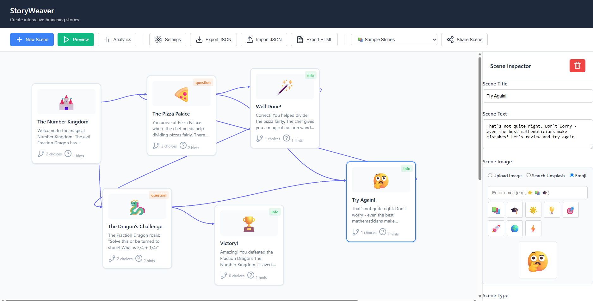

# Visual Story Editor 📚

A comprehensive browser-based visual story editor designed specifically for creating interactive educational content. Build branching narratives with drag-and-drop scenes, educational features, and export standalone HTML stories for students.



## 🌟 Features

### Core Story Creation

- **Visual Canvas**: Drag-and-drop scene nodes on an infinite canvas
- **Branching Narratives**: Create complex story paths with multiple choices
- **Real-time Connections**: Visual lines show story flow between scenes
- **Live Preview**: Test your story as you build it

### Educational Enhancements

- **Scene Categories**: Story, Question/Quiz, Information/Facts, Decision Point
- **Learning Hints**: Add helpful hints for students on any scene
- **Teacher Notes**: Private annotations for educators
- **Image Support**: Upload images, search Unsplash, or use emoji illustrations
- **Learning Analytics**: Automatic complexity analysis and story statistics

### Story Management

- **Sample Stories**: Pre-built educational stories (Math, Science, Environment)
- **Export/Import**: Save stories as JSON files or standalone HTML
- **Scene Sharing**: Share individual scenes via URL
- **Metadata**: Subject classification, difficulty levels, learning objectives

## 🚀 Quick Start

### Running the Editor

1. Open `index.html` in any modern web browser
2. No installation or server required - works entirely offline
3. Start creating your first story with the "New Scene" button

### Creating Your First Story

1. **Add Scenes**: Click "New Scene" to create story nodes
2. **Edit Content**: Click any scene to edit title, text, and choices
3. **Add Images**: Upload, search Unsplash, or choose emoji
4. **Connect Scenes**: Set choice targets to link scenes together
5. **Preview**: Click "Preview" to test your story
6. **Export**: Save as JSON or generate standalone HTML

## 📖 Sample Stories

The editor includes three complete educational stories:

### 1. Math Adventure: Number Kingdom

- **Subject**: Mathematics (Fractions)
- **Grade Level**: Elementary
- **Learning Objectives**: Understanding fractions, problem-solving
- **Scenes**: 6 interactive scenes with math challenges

### 2. Space Exploration: Mission to Mars

- **Subject**: Physics & Astronomy
- **Grade Level**: Middle School
- **Learning Objectives**: Space physics, rocket science, planetary science
- **Scenes**: 7 scenes covering space travel concepts

### 3. Environmental Hero: Lake Crystal

- **Subject**: Environmental Science
- **Grade Level**: Elementary/Middle School
- **Learning Objectives**: Ecosystem understanding, environmental protection
- **Scenes**: 6 scenes about environmental investigation

## 🛠️ Technical Architecture

### Browser Compatibility

- **Modern Browsers**: Chrome 80+, Firefox 75+, Safari 13+, Edge 80+
- **Mobile Friendly**: Responsive design works on tablets and phones
- **No Dependencies**: Pure HTML, CSS, and JavaScript

### Data Storage

- **Local Storage**: Stories saved automatically in browser
- **Export Options**: JSON files for backup and sharing
- **Standalone HTML**: Complete playable stories

### File Structure

```
├── index.html          # Main application
├── styles.css          # All styling and responsive design
├── app.js             # Complete application logic
├── README.md          # This documentation
```

## 🎯 Educational Use Cases

### For Teachers

- **Lesson Planning**: Create interactive lessons with branching scenarios
- **Assessment**: Build quizzes with immediate feedback
- **Storytelling**: Engage students with visual narrative learning
- **Differentiation**: Multiple paths for different learning levels

### For Students

- **Creative Writing**: Build their own interactive stories
- **Project Work**: Create presentations in story format
- **Peer Learning**: Share and play each other's stories
- **Portfolio Building**: Export stories for digital portfolios

### Subject Applications

- **Language Arts**: Creative writing, reading comprehension
- **Science**: Lab simulations, concept exploration
- **Social Studies**: Historical scenarios, decision-making
- **Math**: Problem-solving adventures, concept reinforcement

## 🔧 Advanced Features

### Scene Categories

Each scene can be categorized for better organization:

- **Story**: Narrative content and world-building
- **Question**: Interactive quizzes and assessments
- **Information**: Educational facts and explanations
- **Decision**: Critical thinking and choice points

### Learning Analytics

Automatic analysis provides insights:

- **Story Statistics**: Scene count, complexity metrics
- **Reading Time**: Estimated completion time
- **Path Analysis**: Multiple story routes visualization
- **Educational Metrics**: Learning objective coverage

### Sharing & Export

Multiple ways to share your creations:

- **JSON Export**: Complete story data for backup
- **HTML Export**: Standalone playable files
- **Scene Sharing**: Individual scene URLs
- **Print-Friendly**: Clean layouts for physical handouts

## 🎨 Customization

### Adding Images

1. **Upload**: Drag and drop image files directly
2. **Unsplash**: Search thousands of educational images
3. **Emoji**: Quick visual elements from emoji picker
4. **Alt Text**: Accessibility descriptions for all images

### Educational Metadata

Complete story information:

- **Subject Area**: Mathematics, Science, Language Arts, etc.
- **Grade Level**: Kindergarten through High School
- **Difficulty**: Beginner, Intermediate, Advanced
- **Learning Objectives**: Specific educational goals
- **Tags**: Searchable keywords

## 🔮 Future Enhancements

Planned features for future versions:

- Collaborative editing for team story creation
- Audio narration and sound effects
- Animation and transition effects
- Integration with learning management systems
- Detailed learning analytics dashboard
- Multi-language support for international use

## Images


---

**Built for educators, by educators.** This tool makes interactive educational content creation accessible to teachers and students alike, no coding required.
